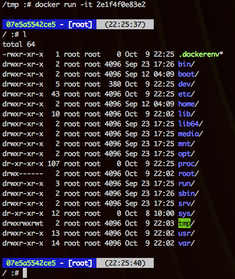

# Bashir

Bashir ("the one who bring good news") is a setup script to initialize Bash
environments. The script initializes commands aliases, the shell prompt, 
path, and command line commands history.

The main goal is to provide a quick way to setup Bash shells, running a 
simple command, for instance while creating a VM, a container or during the 
first access into a system. A Bashir setup endpoing is available and
accessible to curl/wget.

# Quick setup

This command will install Bashir in your Linux shell:

```shell 
curl -s https://dev.ai/bashir/v1|bash
```

This commands installs and runs Bashir without needing to reload the shell:

```shell 
curl -s https://dev.ai/bashir/v1|bash && . ~/.bashir
```

# Docker

You may want to use Bashir to customize your Docker containers' shell, 
for example:

```
FROM debian:jessie

MAINTAINER Devis Lucato devis@lucato.it

LABEL Description="Debian Jessie with Bashir"

RUN \
  apt-get update && \
  apt-get -y --force-yes --no-install-recommends install curl && \
  curl -s https://dev.ai/bashir/v1|bash && \
  apt-get autoclean && apt-get clean && rm -rf /var/lib/apt/lists/*

ENTRYPOINT ["/bin/bash"]
```

# Screenshot



